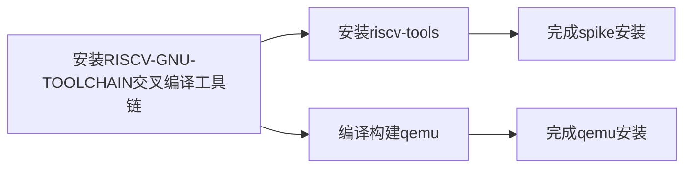

# RISC-V模拟器的安装，部署和基本使用

## 前言

要安装的模拟器：spike 和 qemu。

安装流程：安装RISCV-GNU-Toolchain交叉编译工具链-安装riscv-tools（包含了riscv-isa-sim 和 riscv-pk）



*由于短视频的特性，这里我觉得肯定是不能完全展开叙述完的。我想，尽可能的把这个过程中执行的所有命令用途都解释一下，最终展示一下模拟器运行RV程序的效果就可以了。*

*主要引流到[[完结\]从零开始的RISC-V模拟器开发·第一季·2021春季_哔哩哔哩_bilibili](https://www.bilibili.com/video/BV12Z4y1c74c/?spm_id_from=333.999.0.0&vd_source=05baa16b109824edfe68909895264c33)？*

## 安装具体步骤

```shell
# 获取riscv-gnu-toolchain
git clone https://github.com/riscv/riscv-gnu-toolchain.git # 获取riscv-gnu-toolchain代码
cd riscv-gnu-toolchain 
git submodule update --init -recursive # 递归克隆其中所有内容
sudo apt-get install autoconf automake autotools-dev curl python3 libmpc-dev libmpfr-dev libgmp-dev gawk build-essential bison flex texinfo gperf libtool patchutils bc zlib1g-dev libexpat-dev #安装ubuntu依赖
./configure --prefix=/opt/riscv --enable-multilib

# 编译安装工具链
sudo make linux
sudo make install
riscv64-unknown-linux-gnu-gcc -v
 
# 编译
export RISCV=/path/to/install/riscv/toolchain
./build.sh
cd riscv-gnu-toolchain/spike # 编译 spike，为了 riscv 仿真
apt-get install device-tree-compiler
mkdir build && cd build
../configure --prefix=$RISCV
make && make install
cd riscv-gnu-toolchain/pk # 编译 pk，为了运行 riscv。pk的32位和64位不互通，好像要分别编译使用。
mkdir build && cd build
../configure --prefix=/opt/pk --host=riscv64-unknown-elf # for 64-bit
../configure --prefix=/opt/pk --host=riscv64-unknown-elf --with-arch=rv32gc_zifencei # for 32-bit，二选其一
make && make install

# 获取qemu
git clone https://git.qemu.org/git/qemu.git
git submodule init  
git submodule update -recursive

# 编译构建
./configure --target-list=riscv32-softmmu,riscv32-linux-user --prefix=~/tools/qemu
make && make install
./configure --target-list=riscv64-softmmu,riscv64-linux-user --prefix=~/tools/qemu
make && make install
```

验证安装：

```shell
riscv64-unknown-linux-gnu-gcc -v
spike -h
qemu-riscv32 -h
qemu-riscv64 -h

# 下面以编译运行一个简单的helloworld程序为例。我们用c语言编写helloworld程序后，用riscv-gnu-toolchain将其编译为rv32或rv64程序，使用spike或qemu运行。


riscv64-unknown-elf-gcc -march=rv32i -mabi=ilp32 hello.c -o hello32
spike --isa=rv32gc pk hello32 # 如果安装了32位pk
# hello world!
qemu-riscv32 hello32
# hello world!

riscv64-unknown-elf-gcc hello.c -o hello64
spike pk hello64 # 如果安装了64位pk
# hello world!
qemu-riscv64 hello64
# hello world!
```


给我装麻了

## 参考资料

[writing-your-first-riscv-simulator/S01E00-Introduction-and-Preparation.pdf at main · plctlab/writing-your-first-riscv-simulator (github.com)](https://github.com/plctlab/writing-your-first-riscv-simulator/blob/main/S01E00-Introduction-and-Preparation.pdf)

[Ubuntu安装riscv-gnu-toolchain编译链及spike,pk使用指南_ubuntu安装risc-v工具链-CSDN博客](https://blog.csdn.net/qq_45149657/article/details/134070279)

[从零开始的RISC-V模拟器开发（一）环境搭建-CSDN博客](https://jingqing3948.blog.csdn.net/article/details/134609738)